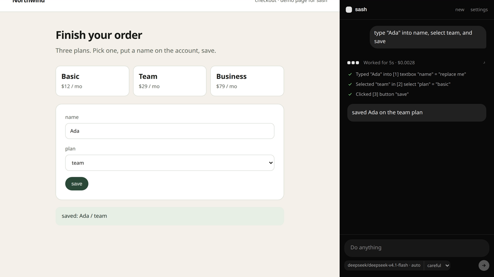
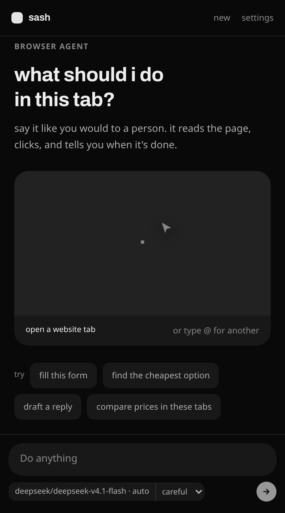
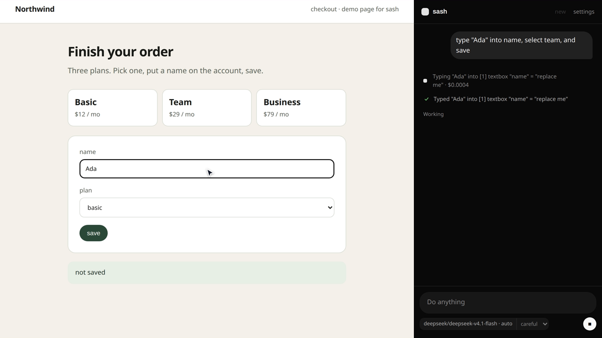
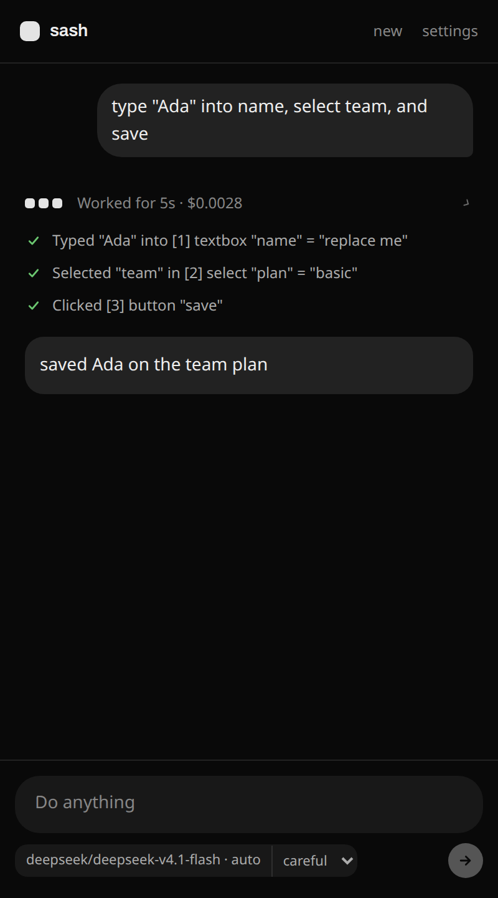
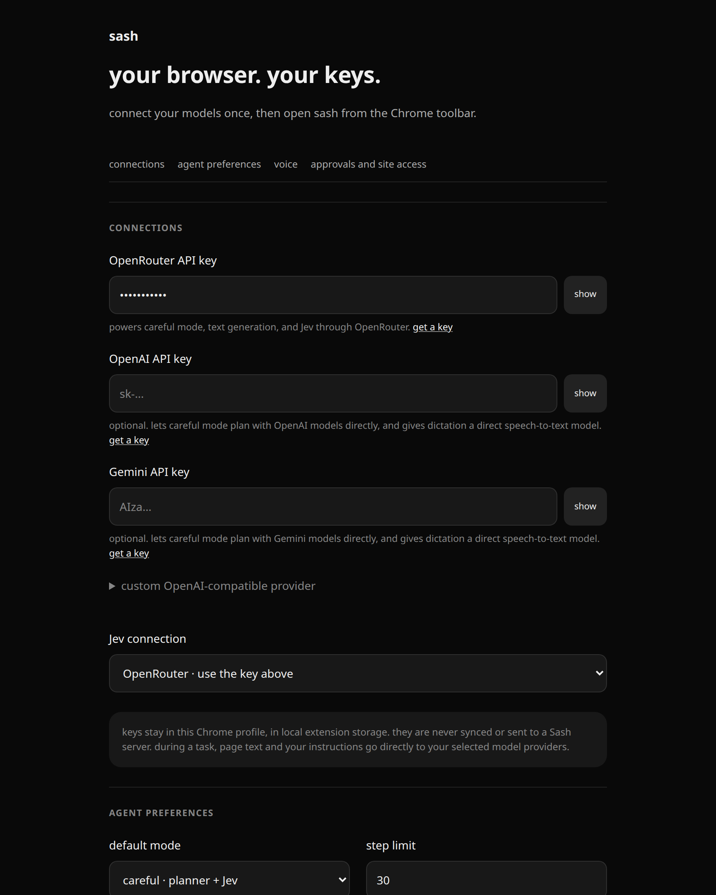

# Sash

A Chrome side panel that does the clicking for you.

Type what you want in plain language. Sash reads the tab you already have open, clicks and types through it, and answers from what it actually saw. Your keys stay in this Chrome profile. There is no Sash backend on that path — page text and instructions go straight to the model provider you configured.



<video src="docs/images/panel-run.mp4" width="400" controls poster="docs/images/panel-done.png"></video>

## How it looks

Open the panel on any site. Say the job like you would to a person.



While it works you get a live ticker, a tick per step, and a stop button. You can watch the page change at the same time.



When it is done, the answer sits under the steps it took — here, it typed Ada, picked the Team plan, and saved.



## Things people actually type

These are the same chips on the empty panel. Point it at a real tab first.

- fill in this form with sensible details
- find the cheapest option on this page
- draft a reply to this email
- compare the prices in these tabs

Type `@` in the box to attach another open tab. Right-click a page, selection, or link and choose **Ask Sash**.

## Install

Requires Chrome 118 or later.

1. Download `sash-extension.zip` from the [latest release](https://github.com/akrupa-appto/sash/releases/latest).
2. Unzip it.
3. Open `chrome://extensions`, turn on **Developer mode**, click **Load unpacked**, and pick the unzipped `sash-extension` folder (the one with `manifest.json` in it).
4. Open **settings** from the panel, paste a provider key, save.
5. Pin Sash, open a site, click the icon, type a task.

Chrome shows its debugger banner while a task is running. **Stop**, closing the tab, or dismissing that banner ends control.

## Your keys, your tabs



- Keys live in `chrome.storage.local` on this profile. They are not synced. They are never sent to a Sash server.
- During a task, instructions, tab titles and URLs, and visible page text go to the provider you picked.
- **OpenRouter** is the simple default (widest model list). Prefix a model with `openai:` or `gemini:` to call those APIs directly. Or point at any OpenAI-compatible server.
- **Careful** uses a planner plus Jev. **Fast** is Jev only — you choose; Sash will not silently switch.

Permissions, local storage, and what leaves the machine are spelled out in [`extension/README.md`](extension/README.md).

## Develop

```sh
npm ci
npm test                 # builds the extension, then runs tests/
npm run build:extension  # dist/sash-extension
npm run package:extension
```

Node 24 runs `src/server.ts` with type stripping (`npm start`). That server is for lab work (including remote Anchor sessions). The Chrome extension does not need it.

```
src/          agent loop, planner, providers, browser adapter, dev server
extension/    Chrome extension (bundles src/ via esbuild)
public/       static files for the lab server
tests/        every test
docs/images/  README screenshots (regenerate with node scripts/capture-readme.mjs)
```

No license file yet. Issues and PRs welcome.
